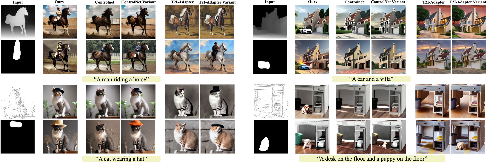

# M-Control: Improving Text-Image Consistency via Mask-Guided ControlNet



## Usage

**To plug-and-play diffusion features, please follow these steps:**

1. [Setup](#setup)
2. [Mask-Guided ControlNet](#inference)

## Setup

Our codebase is built on [huggingface/diffusers](https://github.com/huggingface/diffusers)
and has shared environmental dependencies.

### Creating a Conda Environment

```
conda env create -f environment.yaml
conda activate M-Control
```

## Mask-Guided ControlNet

If you already have a condition input and corresponding mask, first set the hyper-parameters for the generation in a yaml config file. An example of extraction configs can be found in `configs/test.yaml`. Once the arguments are set, run:

```
python inference.py --config <extraction_config_path>
```